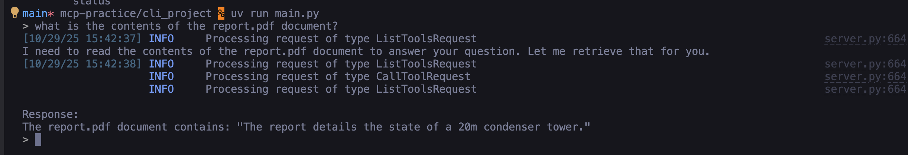

# MCP Chat

MCP Chat is a command-line interface application that enables interactive chat capabilities with AI models through the Anthropic API. The application supports document retrieval, command-based prompts, and extensible tool integrations via the MCP (Model Context Protocol) architecture.

Chat from the cmd line:


## Prerequisites

- Python 3.9+
- Anthropic API Key

## Setup

### Step 1: Configure the environment variables

1. Create or edit the `.env` file in the project root and verify that the following variables are set correctly:

```
ANTHROPIC_API_KEY=""  # Enter your Anthropic API secret key
```

### Step 2: Install dependencies

#### Option 1: Setup with uv (Recommended)

[uv](https://github.com/astral-sh/uv) is a fast Python package installer and resolver.

1. Install uv, if not already installed:

```bash
pip install uv
```

2. Create and activate a virtual environment:

```bash
uv venv
source .venv/bin/activate  # On Windows: .venv\Scripts\activate
```

3. Install dependencies:

```bash
uv pip install -e .
```

4. Run the project

```bash
uv run main.py
```

#### Option 2: Setup without uv

1. Create and activate a virtual environment:

```bash
python -m venv .venv
source .venv/bin/activate  # On Windows: .venv\Scripts\activate
```

2. Install dependencies:

```bash
pip install anthropic python-dotenv prompt-toolkit "mcp[cli]==1.8.0"
```

3. Run the project

```bash
python main.py
```

## Usage

### Basic Interaction

Simply type your message and press Enter to chat with the model.

### Document Retrieval

Use the @ symbol followed by a document ID to include document content in your query:

```
> Tell me about @deposition.md
```

### Commands

Use the / prefix to execute commands defined in the MCP server:

```
> /summarize deposition.md
```

Commands will auto-complete when you press Tab.

## Development

### Adding New Documents

Edit the `mcp_server.py` file to add new documents to the `docs` dictionary.

### Implementing MCP Features

To fully implement the MCP features:

1. Complete the TODOs in `mcp_server.py`
2. Implement the missing functionality in `mcp_client.py`

### Linting and Type Checking

This project uses the following tools for code quality:

- **ruff**: Fast Python linter and code formatter
- **black**: Code formatter
- **mypy**: Static type checker
- **pytest**: Testing framework

#### Install Development Dependencies

```bash
uv sync --group dev
```

#### Running Checks

Use the following commands to run code quality checks:

```bash
# Run linter
uv run ruff check .

# Auto-fix linting issues
uv run ruff check --fix .

# Format code with black
uv run black .

# Check formatting without making changes
uv run black --check .

# Run type checker
uv run mypy .

# Run tests
uv run pytest
```

#### Pre-commit Hooks (Optional)

To automatically run checks before each commit:

1. Install pre-commit:
```bash
uv pip install pre-commit
```

2. Install the git hooks:
```bash
pre-commit install
```

Now the checks will run automatically on each commit.
